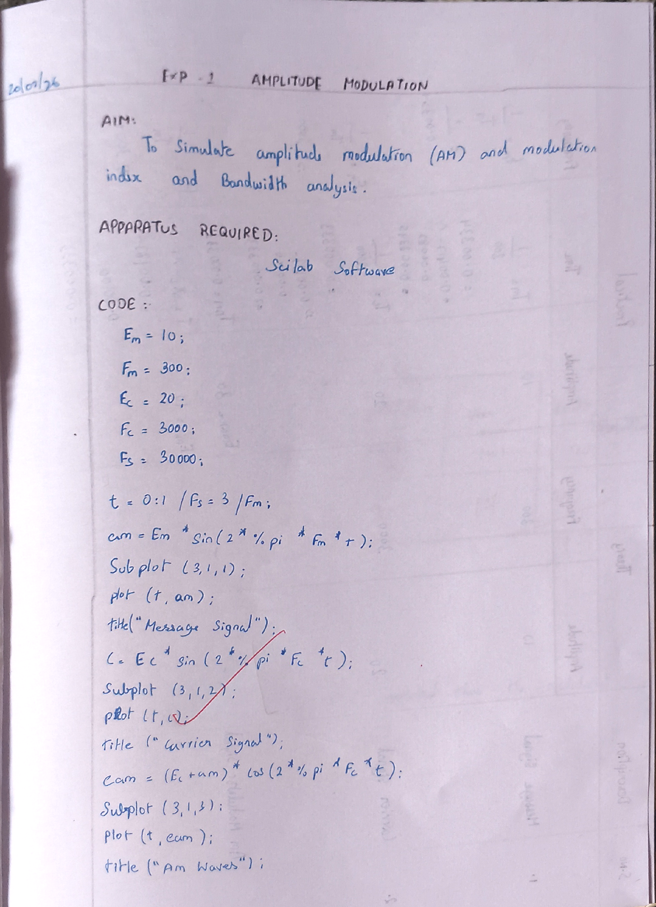
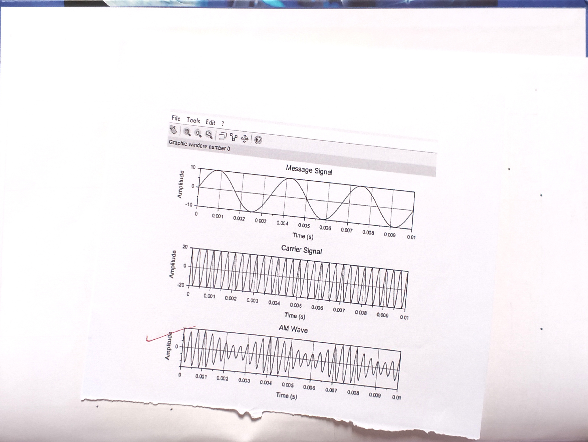
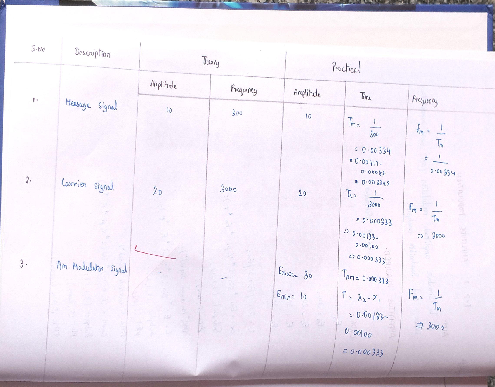
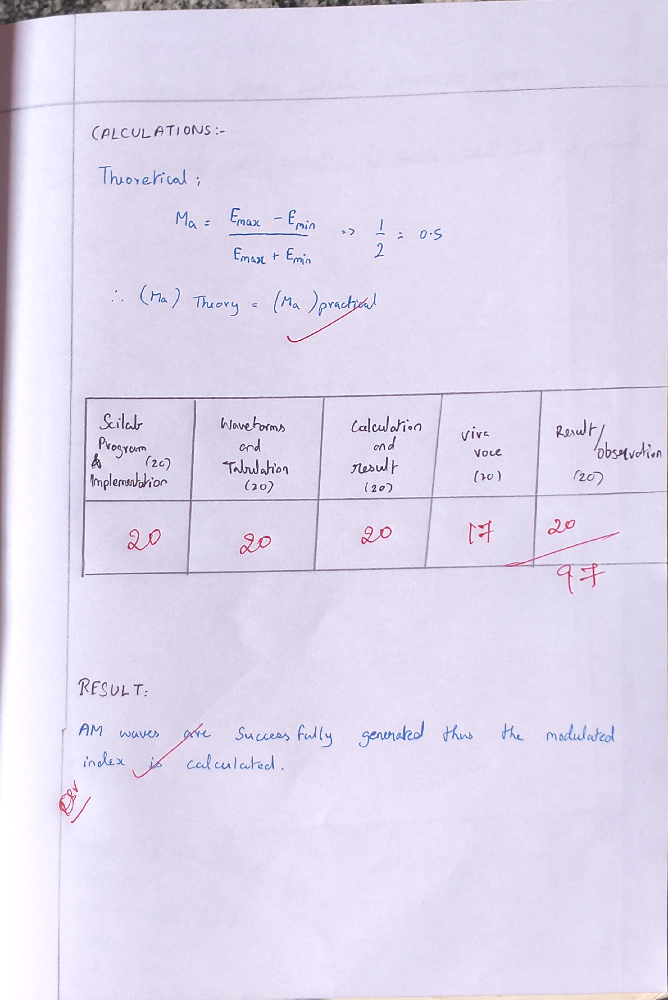

# Generation-and-detection-of-AM-using-SCILAB---T1---M4---ODD
# AIM

To generate and detect the amplitude modulation and demodulation using SCILAB and to calculate modulation index of AM.



# EQUIPMENTS REQUIRED

* Computer with i3 Processor
* SCI LAB

# THEORY

Modulation can be defined as the process by which the characteristics of carrier wave are varied in accordance with the modulating wave (signal). Modulation is performed in a transmitter by a circuit called a modulator.

Need for modulation is as follows:

* Avoid mixing of signals
* Reduction in antenna height
* Long distance communication
* Multiplexing
* Improve the quality of reception
* Ease of radiation

Amplitude Modulation is the process of changing the amplitude of a relatively high frequency carrier signal in proportion with the instantaneous value of the modulating signal. The output waveform contains all the frequencies that make up the AM signal and is used to transport the information through the system. Therefore the shape of the modulated wave is called the AM envelope. With no modulating signal the output waveform is simply the carrier signal. Coefficient of modulation is a term used to describe the amount of amplitude change present in an AM waveform. There are three degrees of modulation available based on value of modulation index.

1. **Under modulation:** `m < 1`, `Em < Ec`
2. **Critical modulation:** `m = 1`, `Em = Ec`
3. **Over modulation:** `m > 1`, `Em > Ec`

**Note:** Keep all the switch faults in off position.

# ALGORITHM

### 1. Define Parameters

First, define the parameters for your signals:

* Carrier frequency (fc)
* Modulating signal frequency (fm)
* Sampling frequency (Fs)
* Duration of the signal (T)

### 2. Create Time Vector

Create a time vector based on the sampling frequency and duration.

### 3. Create Modulating Signal

Define the modulating signal (message signal).

### 4. Create Carrier Signal

Define the carrier signal.

### 5. Perform Amplitude Modulation

Multiply the carrier signal by the modulating signal plus 1 (to ensure the modulation depth).

### 6. Plot the Signals

Visualize the modulating, carrier, and modulated signals.

### 7. Demodulate the AM Signal

To demodulate, you can use envelope detection. One way is to rectify the signal and then apply a low-pass filter.

### 8. Plot the Demodulated Signal

Visualize the demodulated signal.

### 9. Compare Signals

Compare the original modulating signal with the demodulated signal.

# PROCEDURE

* Refer Algorithms and write code for the experiment.
* Open SCILAB in System.
* Type your code in New Editor.
* Save the file.
* Execute the code.
* If any Error, correct it in code and execute again.
* Verify the generated waveform using Tabulation and Model Waveform.

# PROGRAM / CODE

```scilab
Em = 10;
Fm = 300;
Ec = 20;
Fc = 3000;
Fs = 30000;

t = 0:1/Fs:3/Fm;
am = Em * sin(2 * %pi * Fm * t);
subplot(3, 1, 1);
plot(t, am);
title("Message Signal");

c = Ec * sin(2 * %pi * Fc * t);
subplot(3, 1, 2);
plot(t, c);
title("Carrier Signal");

eam = (Ec + am) .* cos(2 * %pi * Fc * t);
subplot(3, 1, 3);
plot(t, eam);
title("Am Waves");
```

# OUTPUT / MODEL GRAPHS



# TABULATION

| Sl. No. | Signal             | Amplitude (V) Theory | Amplitude (V) Practical | Frequency (Hz) Theory | Frequency (Hz) Practical |
| ------- | ------------------ | -------------------- | ----------------------- | --------------------- | ------------------------ |
| 1       | Message Signal     | 10                   | 10                      | 300                   | 300                      |
| 2       | Carrier Signal     | 20                   | 20                      | 3000                  | 3000                     |
| 3       | Modulated Signal   | -                    | Emax = 30, Emin = 10    | -                     | 3000                     |
| 4       | Demodulated Signal | 10                   | 10                      | 300                   | 300                      |

**Modulated Signal:**

* Emax = 30 V
* Emin = 10 V



# CALCULATION

1. **ma (Theory) = am / ac = 10 / 20 = 0.5**

2. **ma (Practical) = (Emax - Emin) / (Emax + Emin) = (30 - 10) / (30 + 10) = 20 / 40 = 0.5**

$$\therefore (M_a)_{Theory} = (M_a)_{Practical} = 0.5$$



# RESULT

AM waves are successfully generated and detected using SCILAB, and the modulation index is calculated:
- Theoretical Modulation Index, $m_a = 0.5$
- Practical Modulation Index, $m_a = 0.5$


